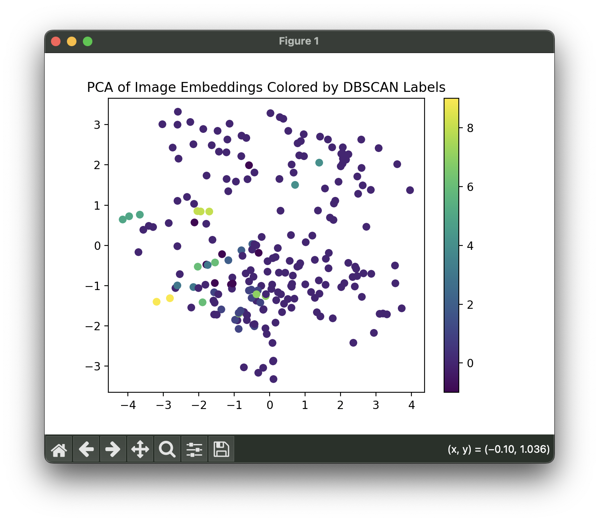
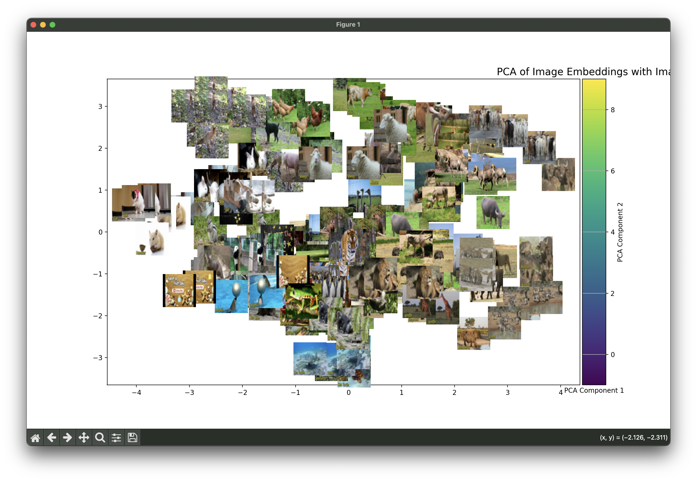

<br>
<p align="center">
	
	<br>
	<h2 align="center">Piaggio &nbsp;</h2>
	<p align="center">A clustering algorithm tool for de-duplicating near exact images in videos using vector embeddings and segmentation clusters.</p>
	<p align="center">
		<a href="https://github.com/codespaces/new/HQarroum/image-deduplication"></a>
	</p>
</p>
<br>

## 🔖 Features

- 📹 **Scene Detection** - Uses [PySceneDetect](https://github.com/Breakthrough/PySceneDetect) to extract transition frames from videos.
- 🤖 **Semantic Fingerprinting** — Uses vector embeddings to perform semantic de-duplication of images.
- ⬛ **Technical Frames Detection** — Filters out black and white technical frames.
- 🖼️ **Image Deduplication** — Allows to semantically de-duplicate images in addition to videos.

## 🚀 Installation

**Using `pip`**

```bash
pip install -r requirements.txt
```

**Using `uv`**

```bash
uv sync
```

> This application requires ffmpeg/mkvmerge for video splitting support.

## What's this ❓

Piaggio is a semantic image clustering tool that you can run from the command-line to de-duplicate near exact images from videos or a collection of images. It uses vector embeddings to perform semantic de-duplication of images and PySceneDetect to extract transition frames from videos.

Use-cases in mind include keyframe extractions from videos (e.g thumbnail generation), or semantic de-duplication of images in a dataset which means this tool will cluster images not only based on their pixel resemblance but also on their semantic content.

## 📚 Usage

#### Extracting keyframes from a video

```bash
uv run src/main.py \
  -v path/to/video.mp4 \
  -o path/to/output/directory
```

##### Workflow


```mermaid
graph LR
	A[Video] --> B(Scene Detection)
	B --> C(Semantic Fingerprinting)
	C --> D(Technical Frames Filtering)
	D --> E(Clustering)
	E --> F(Deduplication)
```

#### Deduplicating images

```bash
uv run src/main.py \
	-d path/to/images/directory \
	-o path/to/output/directory
```

##### Workflow


```mermaid
graph LR
	A[Images] --> B(Semantic Fingerprinting)
	B --> C(Clustering)
	C --> D(Deduplication)
```

#### Plot the clusters

```bash
uv run src/main.py \
	-d path/to/images/directory \
	-o path/to/output/directory \
	--plot
```

<p align="center">
	
</p>

#### Plot the images in the clusters

```bash
uv run src/main.py \
  -d path/to/images/directory \
  -o path/to/output/directory \
  --plot-images
```

<p align="center">
	
</p>

## 📟 Options

- `-v` or `--video` - Path to the video file to process.
- `-d` or `--directory` - Path to the images directory to process.
- `-o` or `--output` - Path to the output directory where to store the results.
- `-m` or `--model` - Path to the CLIP embedding model name to use for semantic de-duplication (default: `ViT-B/32`).
- `-e` or `--epsilon` - The epsilon value to use for the DBSCAN clustering algorithm (default: `0.2`).
- `-s` or `--min-samples` - The minimum number of samples to use for the DBSCAN clustering algorithm (default: `5`).
- `-t` or `--metric` - The metric to use for the DBSCAN clustering algorithm (default: `cosine`).
- `-p` or `--plot` - Whether to plot the clusters or not (default: `False`).
- `-i` or `--plot-images` - Whether to plot the images in the clusters or not (default: `False`).
