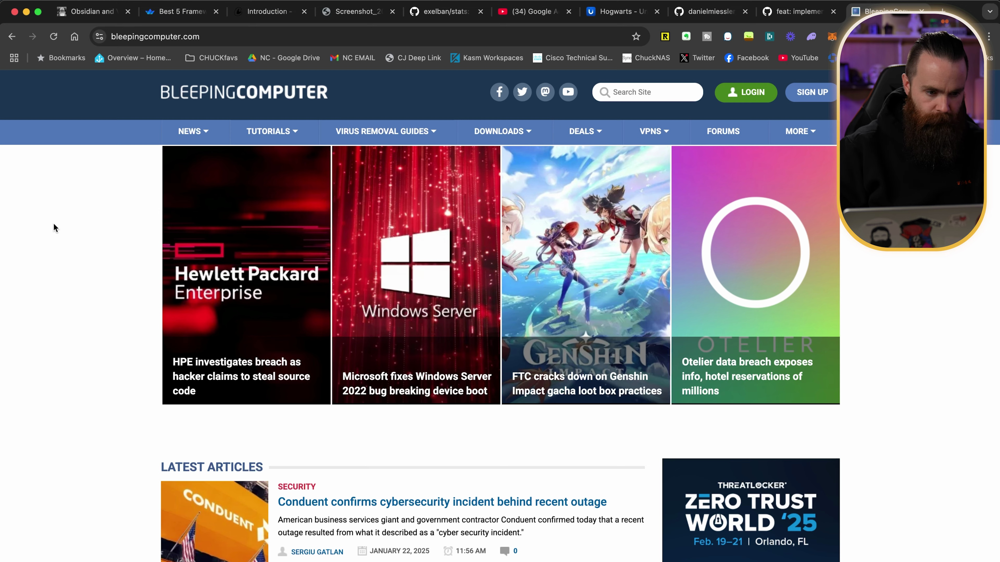

<br>
<p align="center">
	
	<br>
	<h2 align="center">Piaggio &nbsp;</h2>
	<p align="center">A clustering algorithm tool for de-duplicating near exact images in videos using vector embeddings and segmentation clusters.</p>
	<p align="center">
		<a href="https://github.com/codespaces/new/HQarroum/piaggio"></a>
	</p>
</p>
<br>

## 🔖 Features

- 📹 **Scene Detection** - Uses scene detection to extract transition frames from videos.
- 🤖 **Semantic Fingerprinting** — Uses vector embeddings to perform semantic de-duplication of images.
- ⬛ **Technical Frames Detection** — Filters out black and white technical frames.
- 🖼️ **Image Deduplication** — Allows to semantically de-duplicate images in addition to videos.
- 📈 **Plotting** - Allows to plot and visualize the image clusters.
- 🦎 **Local-first** - Runs entirely locally, on GPU or CPU.

## 🚀 Installation

**Using `pip`**

```bash
pip install -r requirements.txt
```

**Using `uv`**

```bash
uv sync
```

> This application requires ffmpeg/mkvmerge for video splitting support.

## What's this ❓

Piaggio is a semantic image clustering tool that you can run from the command-line to de-duplicate near exact images from videos or a collection of images. It uses vector embeddings to perform semantic de-duplication of images and [PySceneDetect](https://github.com/Breakthrough/PySceneDetect) to extract transition frames from videos.

Use-cases in mind include keyframe extractions from videos (e.g in the context of thumbnail generation), or semantic de-duplication of images in a dataset by clustering images not only based on their pixel resemblance but also on their semantic content.

## 📚 Usage

#### Extracting keyframes from a local video

```bash
uv run src/main.py \
  -v path/to/video.mp4 \
  -o path/to/output/directory
```

##### Workflow


#### Extracting keyframes from a YouTube video

Install [`yt-dlp`](https://github.com/yt-dlp/yt-dlp) locally to download videos from YouTube.

> ℹ️ This is only provided as an example for research purposes, use responsibly according to YouTube's terms of service.

```bash
# Download video and encode as MP4.
yt-dlp \
  -S res,ext:mp4:m4a \
  --recode mp4 \
  'https://www.youtube.com/watch?v=<video-id>'

# Extract keyframes.
uv run src/main.py \
  -v path/to/video.mp4 \
  -o path/to/output/directory
```

In this example, we're trying [this NetworkChuck video](https://www.youtube.com/watch?v=Ju0ndy2kwlw) which is 1.4 GB in size, 34 minutes long, and contains 62,836 frames in total. Piaggio managed to reduce the number of frames to only 22 images after clustering. Below are some of the extracted keyframes from the semantic cluster.

<br />
<table>
  <tr>
    <td>
      
    </td>
    <td>
      
    </td>
    <td>
      
    </td>
    <td>
      
    </td>
    <td>
      
    </td>
  </tr>
  <tr>
    <td>
      
    </td>
    <td>
      
    </td>
    <td>
      
    </td>
    <td>
      
    </td>
    <td>
      
    </td>
  </tr>
  <tr>
    <td>
      
    </td>
    <td>
      
    </td>
    <td>
      
    </td>
    <td>
      
    </td>
    <td>
      
    </td>
  </tr>
</table>
<br />

#### Deduplicating images from a local directory

```bash
uv run src/main.py \
  -d path/to/images/directory \
  -o path/to/output/directory
```

##### Workflow


#### Plot the clusters

```bash
uv run src/main.py \
  -d path/to/images/directory \
  -o path/to/output/directory \
  --plot
```

<p align="center">
	
</p>

#### Plot the images in the clusters

```bash
uv run src/main.py \
  -d path/to/images/directory \
  -o path/to/output/directory \
  --plot-images
```

<p align="center">
	
</p>

## 📟 Options

- `-v` or `--video` - Path to the video file to process.
- `-d` or `--directory` - Path to the images directory to process.
- `-o` or `--output` - Path to the output directory where to store the results.
- `-m` or `--model` - Path to the CLIP embedding model name to use for semantic de-duplication (default: `ViT-B/32`).
- `-e` or `--epsilon` - The epsilon value to use for the DBSCAN clustering algorithm (default: `0.2`).
- `-s` or `--min-samples` - The minimum number of samples to use for the DBSCAN clustering algorithm (default: `5`).
- `-t` or `--metric` - The metric to use for the DBSCAN clustering algorithm (default: `cosine`).
- `-p` or `--plot` - Whether to plot the clusters or not (default: `False`).
- `-i` or `--plot-images` - Whether to plot the images in the clusters or not (default: `False`).
